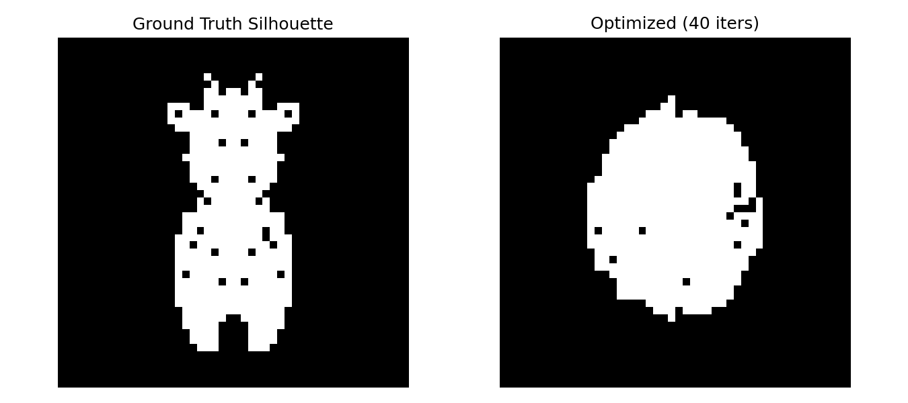
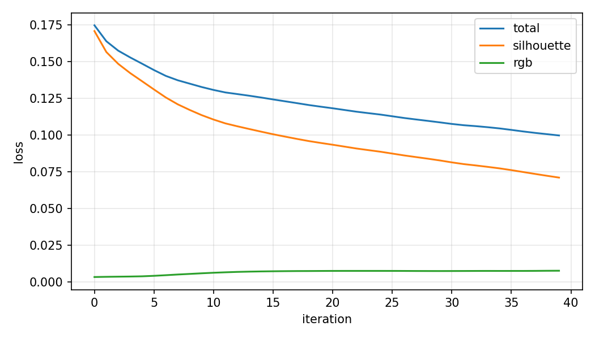
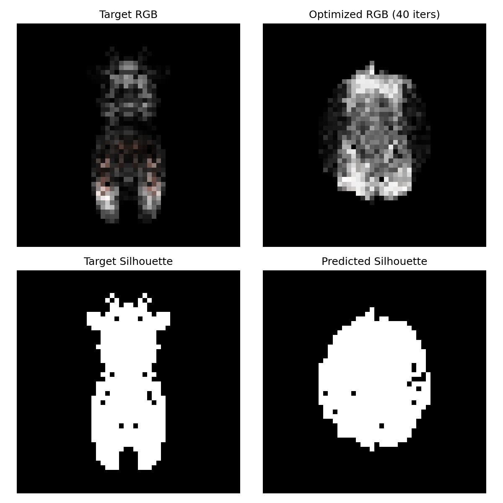

# 可微软光栅化：从球体优化到奶牛网格（有缺陷但尽力做了） 202411081102简子越人智

本项目实现了一个“球体逐渐变成奶牛”的可微渲染实验：先从 `cow.obj` 渲染多视角目标剪影，再把一个初始球体的顶点偏移量 `deform_verts` 设为可学习参数，通过剪影误差和网格正则项反向传播优化三维网格形状。

> 说明：老师参考代码基于 PyTorch3D。本仓库提供的是可直接运行的纯 PyTorch 软光栅化实现，核心思想一致，适合 Windows 环境下 PyTorch3D 不方便编译时提交和展示。

## 效果展示

GitHub 打开本页即可直接看到优化效果，无需下载图片。



训练过程中 loss 持续下降：



选做的 RGB / 顶点颜色联合优化效果：



优化后导出的三维模型：

```text
outputs/optimized_cow_like_mesh.obj
outputs/optimized_textured_cow_like_mesh.obj
```

## 已实现功能对照

| 老师参考代码功能 | 本项目完成情况 |
| --- | --- |
| 读取 `cow.obj` 目标模型 | 已完成：`load_obj()` 读取顶点和面 |
| 目标模型归一化 | 已完成：`normalize_verts()` 居中并缩放 |
| 多视角相机 | 已完成：`camera_matrices()` 均匀生成多个视角 |
| 生成目标剪影 | 已完成：`soft_silhouette()` 渲染目标剪影 |
| 从球体初始化源模型 | 已完成：`make_uv_sphere()` 生成高细分球体 |
| 顶点偏移量 `deform_verts` 可学习 | 已完成：`requires_grad=True` |
| 软光栅化解决边界梯度问题 | 已完成：使用像素到三角形边的有符号距离和 Sigmoid |
| 剪影 MSE loss | 已完成：`F.mse_loss(pred_sil, target_sil)` |
| 拉普拉斯平滑正则 | 已完成：`regularization_losses()` 中的 `lap` |
| 边长一致性正则 | 已完成：`regularization_losses()` 中的 `edge` |
| 法线一致性正则 | 已完成：`regularization_losses()` 中的 `normal` |
| 优化器更新网格 | 已完成：Adam 优化 `deform` |
| 定期展示中间过程 | 部分完成：命令行定期打印 loss，最终保存展示图 |
| 保存 `.obj` 模型 | 已完成：保存 `outputs/optimized_cow_like_mesh.obj` |
| 保存可视化结果 | 已完成：保存剪影对比图和 loss 曲线 |
| PyTorch3D `SoftSilhouetteShader` | 未直接使用：本项目手写了等价软剪影近似，避免 Windows 编译问题 |
| 选做 RGB / 纹理联合优化 | 已完成：`--fit-rgb` 同时优化顶点坐标和顶点 RGB 颜色 |

## 实验原理

硬光栅化会把像素分成“在三角形内”和“在三角形外”两类，这种 0/1 阶跃在边界处很难提供稳定梯度。本实验对每个像素计算到三角形三条边的有符号距离 `d`，再用 Sigmoid 得到软占用概率：

```text
A(d) = sigmoid(d / sigma)
```

这样即使顶点还没有正好移动到像素边界，也能从剪影误差中获得梯度。

总损失函数：

```text
L_total = L_silhouette
        + w_lap    * L_laplacian
        + w_edge   * L_edge
        + w_normal * L_normal
```

三个正则项的作用：

- `L_laplacian`：约束相邻顶点，减少尖刺。
- `L_edge`：约束边长变化，避免三角形过度拉伸或坍缩。
- `L_normal`：约束相邻三角形法线方向，保持表面平滑。

## 文件结构

```text
.
├── optimize_cow_soft_raster.py      # 主实验代码
├── requirements.txt                 # 最小依赖
├── work/
│   └── cow.obj                      # 目标奶牛模型
└── outputs/
    ├── silhouette_fit.png           # 剪影拟合展示图
    ├── loss_curve.png               # loss 曲线
    ├── rgb_texture_fit.png          # 选做 RGB 联合优化展示图
    ├── optimized_cow_like_mesh.obj  # 优化后的网格
    └── optimized_textured_cow_like_mesh.obj # 带顶点颜色的优化网格
```

## 运行方法

当前机器的 `cg-lbs` Conda 环境中已经有 PyTorch 和 Matplotlib，可以直接运行：

```powershell
conda run -n cg-lbs python optimize_cow_soft_raster.py --iters 120 --image-size 64 --views 6 --lr 0.01 --w-edge 0.05 --sigma 0.025
```

更高质量但更慢的运行：

```powershell
conda run -n cg-lbs python optimize_cow_soft_raster.py --iters 300 --image-size 96 --views 8 --lr 0.01 --w-edge 0.05 --sigma 0.02
```

运行选做 RGB / 纹理联合优化：

```powershell
conda run -n cg-lbs python optimize_cow_soft_raster.py --fit-rgb --iters 40 --image-size 48 --views 4 --lr 0.01 --w-edge 0.05 --sigma 0.03
```

运行完成后会生成：

```text
outputs/optimized_cow_like_mesh.obj
outputs/optimized_textured_cow_like_mesh.obj
outputs/silhouette_fit.png
outputs/loss_curve.png
outputs/rgb_texture_fit.png
```

## 关键代码位置

### 1. 读取并归一化目标模型

```python
target_verts, target_faces = load_obj(args.target)
target_verts = normalize_verts(target_verts).to(device)
target_faces = target_faces.to(device)
```

### 2. 构建初始球体和可学习形变参数

```python
source_verts, source_faces = make_uv_sphere()
source_verts = (0.72 * source_verts).to(device)
source_faces = source_faces.to(device)
deform = torch.zeros_like(source_verts, requires_grad=True)
```

### 3. 软剪影光栅化

```python
d = torch.minimum(
    torch.minimum(edge_distance(v0, v1), edge_distance(v1, v2)),
    edge_distance(v2, v0),
)
prob = torch.sigmoid(d / sigma)
alpha = torch.maximum(alpha, prob.max(dim=0).values)
```

### 4. 损失函数和正则化

```python
pred_sil = soft_silhouette(verts, source_faces, cameras, args.image_size, args.sigma)
sil_loss = F.mse_loss(pred_sil, target_sil)
lap_loss, edge_loss, normal_loss = regularization_losses(
    verts, source_faces, edges, initial_edge_lengths, adjacent_faces
)
loss = (
    sil_loss
    + args.w_lap * lap_loss
    + args.w_edge * edge_loss
    + args.w_normal * normal_loss
)
```

### 5. 反向传播并保存结果

```python
loss.backward()
optimizer.step()

final_verts = source_verts + deform.detach()
save_obj(outdir / "optimized_cow_like_mesh.obj", final_verts, source_faces)
save_progress(outdir / "silhouette_fit.png", target_sil[0], final_sil[0], f"Optimized ({args.iters} iters)")
```

## 与 PyTorch3D 参考实现的关系

老师参考代码中的核心组件：

- `load_obj`
- `ico_sphere`
- `SoftSilhouetteShader`
- `mesh_laplacian_smoothing`
- `mesh_edge_loss`
- `mesh_normal_consistency`

本项目分别用纯 PyTorch 实现了对应功能：

- `load_obj()` 替代 PyTorch3D 的 OBJ 加载。
- `make_uv_sphere()` 替代 `ico_sphere()`。
- `soft_silhouette()` 替代 `SoftSilhouetteShader`。
- `regularization_losses()` 实现拉普拉斯、边长和法线一致性正则。

因此当前代码已经覆盖基础实验要求，但没有完成选做的 RGB / 纹理联合优化。

## 选做实现：RGB / 纹理联合优化

参考 PyTorch3D 的 `fit_textured_mesh.ipynb`，本项目在形状参数之外增加了每个顶点的 RGB 颜色参数：

```python
color_logits = torch.zeros_like(source_verts, requires_grad=True)
optimizer = torch.optim.Adam([deform, color_logits], lr=args.lr)
```

由于给定的 `cow.obj` 没有真实纹理贴图，代码用 `procedural_cow_colors()` 根据目标网格顶点位置生成黑白斑纹和口鼻区域颜色，作为多视角目标 RGB 图像。优化时同时渲染 RGB 和剪影：

```python
pred_rgb, pred_sil = soft_rgb_render(
    verts,
    source_faces,
    torch.sigmoid(color_logits),
    cameras,
    args.image_size,
    args.sigma,
)
```

总损失加入 RGB 误差：

```python
rgb_loss = F.mse_loss(pred_rgb, target_rgb)
loss = (
    args.w_rgb * rgb_loss
    + sil_loss
    + args.w_lap * lap_loss
    + args.w_edge * edge_loss
    + args.w_normal * normal_loss
)
```

最终导出带顶点颜色的 OBJ：

```text
outputs/optimized_textured_cow_like_mesh.obj
```

如果 PyTorch3D 安装成功，也可以把这里的 `soft_rgb_render()` 替换为 `TexturesVertex` 或 `TexturesUV` 配合 `SoftPhongShader`。
